# VReactable

VReactable is an interface connects the VR world and Reality. The tool runs on an VR platform named Resonite, which is a platform that users can customize their own space and writing scripts in the space. VReactable provides a tangible interface that users can manipulate a Resonite world by moving cubes in real world. This brings an oppotunity for users to interact with VR users in a different way.

This repository is the marker tracking tool for VReactable. To use this tool, you are required to download [Chataigne](https://github.com/willake/vreactable) and [Resonite](https://store.steampowered.com/app/2519830/Resonite/)

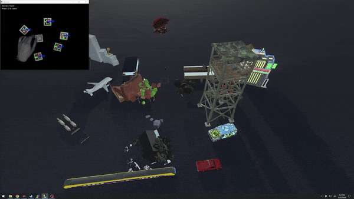

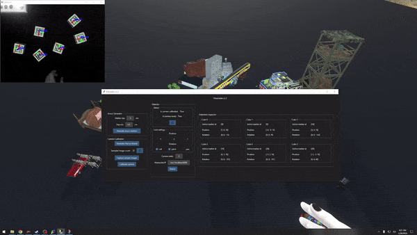

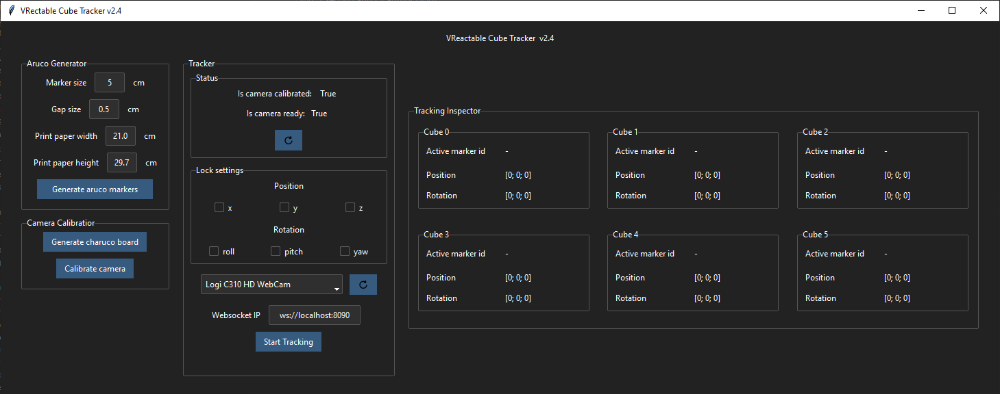

## Installation

You are not required to download the source code. To run this tool, you can simply download the [release version](https://github.com/willake/vreactable/releases/). In the downloaded version, there is a `calib.npz` file inside `resources/calibration`. It is a calibrated parameter file we made. The camera we used is Logitech C310 webcam, which means if the user is using the same camera, the calibration process is skippable. Otherwise, it is required to do the calibration again to make the parameters fit different camera.

## Prerequisite

To use this tool, there are 3 components need to be prepared.

### Component 1: Webcam and Aruco Markers

#### Camera

Connect the webcam with your computer or laptop. Next, locate your camera above a plane like a empty table. The optimal height will be 80cm.

When camera is located, it is required to calibrate camera parameters. First, we need to print a Charuco Board. Charuco Board is a common material to calibrate the camera parameters for increasing accurancy of tracking. By clicking the button `Generate charuco board`, the board image will be generated in `${projectfolder}\resources\aruco\charuco_board`.

Now it is ready for calibration. Click the button `Capture sample images`, a window will show up. Then, present your Charuco Board in the camera view. When all the markers are tracked, press `S` on your keyboard to save the sample image. Take at least 20 images from different angles and distances can have a best quality of camera parameters.

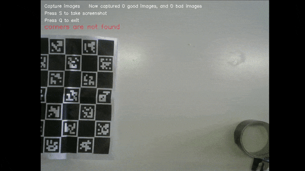

Lastly, press Calibrate camera to start calibration. In the end a `calib.npz` file should be seen at `${projectfolder}\resources\calibration`. Note that you do not need to recalibrate the camera if you change the location because the calibration parameters the tool records does not contain position and rotation data.

#### Aruco markers

Camera is ready, then you will need to have markers for tracking. Open `VReactable.exe`. There is a section called `Aruco Generator`. Usually users do not need to adjust any settings. By clicking button `Generate Aruco markers`, a set of Aruco markers will be generated in `${projectfolder}\resources\aruco\markers`. An easy printing version will be at `${projectfolder}\resources\aruco\packed`. For the markers, it will be more handy if they are attached to a cube.

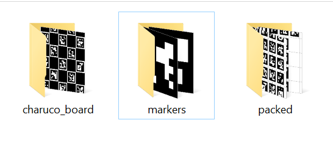

-- placeholder for placing image --
The setup includes a camera and 36 aruco tags.

### Component 2: Websocket Server

To send data to Resonite, we will need a websocket server as a middleware. We use Chataigne as the websocket server since it is easy to setup. It is also possible to replace it by any other websocket server applications. The function of the server is to receive data from the tracking software and reflect(brodcast) the data to all clients.

To use Chataigne, first download the [1.9.7](https://benjamin.kuperberg.fr/chataigne/user/data/Chataigne-win-x64-1.9.7.exe) version. Next, download the [template](https://drive.google.com/file/d/11mTlseGczexTcRwXIAMDaV-fiIk-UgM_/view?usp=drive_link) we prepared. Load the template then websocket server is ready to go.

### Component 3: Resonite World

Next, download Resonite on Steam. Open Resonite and create a world. Import the VReactable inventory by copy `resrec:///G-HKU-Mixed-Reality/R-6586E3FF28427F32F9B8D2ADA8408D8DCEF6AE7894A49781AADAA08F7DB1FE57` and `Ctrl+V` in the game. Right click the object and save it to the inventory. Note that if it is not savable, it is because the current foloder is not a savable location.

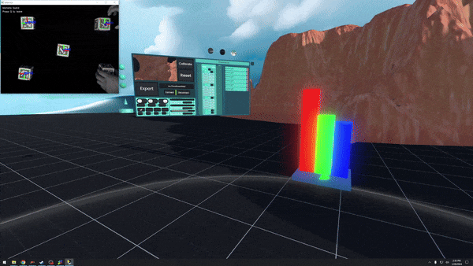
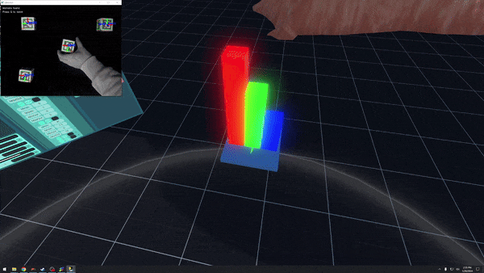
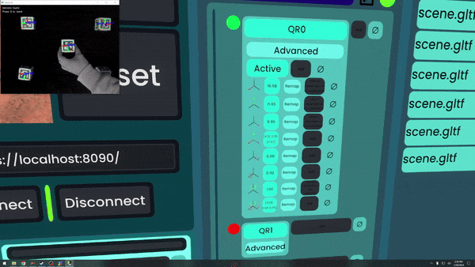

## Start Tracking

Set the websocket IP to the same as your Chataigne server. If it is running in the same device as the tracker. The ip should be `ws://localhost:${your_port}`. If it is 8090 then the ip would be `ws://localhost:8090`. By clicking the `Start Tracking` button on VReactable software, the tracking will start and send data to Resonite.

> For the status section of the tracker. `Is camera calibrated` indicates that whether the tool found a file named `calib.npz` inisde `resources/calibration`. As for `Is camera ready`, it check whether the selected camera index is available. Camera index is the index of connected camera. If you have more than 1 camera connected, remeber to select the right index. Also make sure that the camera is not used by another software.

> Note that to increase the tracking quality, you can also adjust the camera settings like making it gray or lowering the exposure and increasing the gain. To do so, either use the driver of your webcam or OBS can help. Making the background dark is also very helpful.

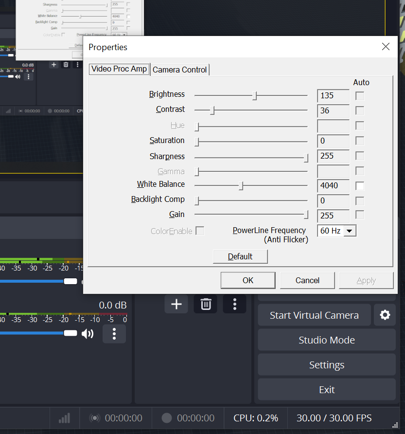

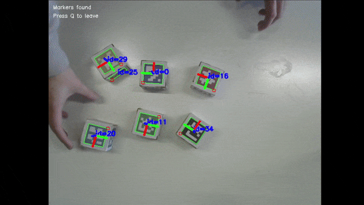
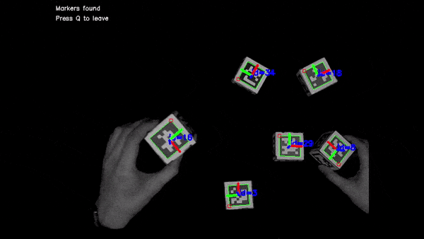

## More questions?

If the question is regarding resonite, a possible solution is to visit [Resonite discord](https://discord.gg/resonite).

If it is a question about the code, you can contact me by emailing huienlin.game@gmail.com

## How to run from source code (Technical)

The environement I ran this code is Python `3.11.7`. If you are new to Python, I would recommend looking into pyenv for installing Python. It provides a easier way to manage different versions and also prevent corrupting the environment, which happens very often. (If you are using Windows, there is a [specific version for Windows](https://github.com/pyenv-win/pyenv-win).)

To install required packages, run

```
pip install -r requirements.txt
```

The code can be ran by typing

```
python vreactable.py
```

To build an executable file from the code. You can run `build.bat` (Windows only) or run the following command.

```
pyinstaller -F vreactable.py
```

## Credits
VReactable is a research project at [Hogeschool voor de Kunsten Utrecht](https://www.hku.nl/). We collaborate with an XR researcher, [Joris Weijdom](https://www.hku.nl/en/research/professorships/performative-creative-processes/phd-research-joris-weijdom), to develop a tool that not only inspire XR artists but also intrigue people that have no experience in XR.  

The right of this project and the code is belongs to HKU. While referencing this project, It will be necceessary to mention HKU and the people participate in developing this tool.

### Developers
**Cube tracker developer** [Hui En Lin](https://hui-en.me)  <br>
**Resonite tool developer / 3D Artist** [David Jak](https://linktr.ee/Davidoo379)  <br>
**Interaction designer** [Tom Zevering](http://snuuf.com/)

The file will appear in the `dist` folder. Remember to copy `config.ini` and the `assets` folder to the dist folder after building the software if they are not there.

## What need to improved (Technical)

- Run VReactable and OpenCV detector on different threads, so that you can force close OpenCV window when VReactable is closed.
