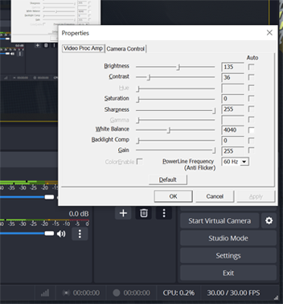

# VReactable Cube Tracker

VReactable is an interface that serves as a bridge between the virtual reality (VR) realm and the physical world. The tool runs on a VR platform named [Resonite](https://store.steampowered.com/app/2519830/Resonite/), which is a platform that allows users to customize their own space and write scripts in their virtual space. VReactable provides a tangible interface in which users can manipulate a Resonite world by moving cubes in the real world. This brings an opportunity for users to interact with VR users differently.

## Requirement

- Download [Resonite](https://store.steampowered.com/app/2519830/Resonite/)
- Download [Chataigne 1.9.7](https://benjamin.kuperberg.fr/chataigne/user/data/Chataigne-win-x64-1.9.7.exe) (Please stick with this version)
- [Chataigne Official Website](http://benjamin.kuperberg.fr/chataigne/en)


## Installation

Downloading the source code is not necessary for running this tool. You can easily utilize the tool by downloading the [release version](https://github.com/willake/vreactable/releases/).

## Prerequisite to run VReactable

To execute the complete VReactable pipeline, three components must be prepared.

### Component 1: Webcam and Aruco Markers

#### Camera

Connect the webcam with your computer or laptop. Next, locate your camera above a plane, such as an empty table, at an optimal height of 80cm.

Once the camera is in place, it's essential to calibrate its parameters. To do this, print a Charuco Board, a common tool for enhancing tracking accuracy during camera calibration. Click the `Generate charuco board` button to create the board image, which will be saved in `${projectfolder}\resources\aruco\charuco_board`.

With the Charuco Board ready, select the camera you wish to calibrate and click the `Calibrate Camera` button to open a window. Display the Charuco Board within the camera's view, and when all markers are tracked, press `S` on your keyboard to save the sample image. For optimal results, capture at least 20 images from various angles and distances. Once enough samples are obtained, press `Q` to initiate the calibration process. During calibration, each sample will be presented, allowing you to decide whether to accept (`A`) or reject (`R`) a particular sample.


In the end, a `calib.npz` file should be seen at `${projectfolder}\resources\calibration`.

**Note that it is not required to recalibrate the camera every time, it can be done at once.**

**Also, you do not need to recalibrate the camera if the camera roatation/location is changed because the calibration parameters does not contain position and rotation data.**

#### Aruco markers

Once your camera setup is complete, the next step is to obtain markers for tracking. In the tracker tool, navigate to the 'Aruco Generator' section. Typically, users won't need to adjust any settings. Simply click the 'Generate Aruco markers' button, and a set of Aruco markers will be generated in ${projectfolder}\resources\aruco\markers. Additionally, a printer-friendly version will be available at `${projectfolder}\resources\aruco\packed`.

For practical use, it's recommended to affix the markers to a cube. The setup includes 36 aruco markers. The actual size of the markers on the printed paper is calculated as `marker size + (gap size * 2)`. The default paper size is set to A4, and it's crucial to leave some white space around the marker to ensure proper detection. Feel free to customize the marker color, but ensure it contrasts sharply with the background for optimal performance.


### Component 2: Websocket Server

For transmitting data to Resonite, a middleware WebSocket server is required. Chataigne is recommended for this purpose due to its easy setup. However, it's possible to substitute it with any other WebSocket server application. The server's role is to receive data from the tracking software and broadcast it to all clients.

If you opt for Chataigne, start by opening Chataigne version 1.9.7. Then, download the [template](https://github.com/willake/vreactable/releases) provided. Load the template, and your WebSocket server using Chataigne will be ready for operation.

### Component 3: Resonite World

Next, download Resonite on Steam. Open Resonite and create a world. Import the VReactable inventory by copy `resrec:///G-HKU-Mixed-Reality/R-6586E3FF28427F32F9B8D2ADA8408D8DCEF6AE7894A49781AADAA08F7DB1FE57` and `Ctrl+V` in the game. Right click the object and save it to the inventory. Inside the VReactable inventory, there are some preset worlds for learning how to use the tool.

> Note that if it is not savable, it is because the current foloder is not a savable location.


## Start Tracking

Configure the WebSocket IP to match that of your Chataigne server. If Chataigne is running on the same device as the tracker, set the IP to `ws://localhost:${your_port}`. For example, if it is running on port 8090, the IP would be `ws://localhost:8090`. Once configured, clicking the `Start Tracking` button in the VReactable software initiates tracking and sends data to Resonite.

> For the status section of the tracker. `Is camera calibrated` indicates that whether the tool found a file named `calib.npz` inisde `resources/calibration`. As for `Is camera ready`, it check whether the selected camera index is available. Camera index is the index of connected camera. If you have more than 1 camera connected, remeber to select the right index. Also make sure that the camera is not used by another software.

> Keep in mind that for enhanced tracking quality, consider adjusting the camera settings, such as switching to grayscale, reducing exposure, and increasing gain. You can accomplish this either through your webcam's driver settings or by utilizing OBS. Additionally, creating a darker background can significantly improve tracking accuracy.




## More questions?

If the question is regarding resonite, a possible solution is to visit [Resonite discord](https://discord.gg/resonite).

If it is a question about the code, you can contact me by emailing huienlin.game@gmail.com

## How to run from source code (Technical)

The environement I ran this code is Python `3.11.4`. If you are new to Python, I would recommend looking into pyenv for installing Python. It provides an easier way to manage different versions and also prevent corrupting the environment, which happens very often. (If you are using Windows, there is a [specific version for Windows](https://github.com/pyenv-win/pyenv-win).)

To install required packages, run

```
pip install -r requirements.txt
```

The code can be ran by typing

```
python vreactable.py
```

To build an executable file from the code. You can run `build.bat` (Windows only) or run the following command.

```
pyinstaller -F vreactable.py
```

The file will appear in the `dist` folder. Remember to copy `config.ini` and the `assets` folder to the dist folder after building the software if they are not there.

## Some Technical Notes

- `cv2.CAP_DSHOW` is added to `cv2.VideoCapute()`. It dramatically decreases the camera open time, but it makes the code only work on Windows. If you would like to further develop this tool for more platforms. Consider remove it or add a check if it is on Windows.

## Credits

VReactable is a research project conducted at  [Hogeschool voor de Kunsten Utrecht](https://www.hku.nl/). We are in collaboration with XR researcher [Joris Weijdom](https://www.hku.nl/en/research/professorships/performative-creative-processes/phd-research-joris-weijdom) to create a tool designed to inspire XR artists and captivate individuals without prior experience in XR.

The rights to this project are reserved by HKU. When referencing this project, it is necessary to acknowledge HKU. Additionally, it would be appreciated to mention the individuals who actively contributed to the development of this tool.

### Developers

**Cube tracker developer** [Hui En Lin](https://hui-en.me) <br>
**Resonite tool developer / 3D Artist** [David Jak](https://linktr.ee/Davidoo379) <br>
**Interaction designer** [Tom Zevering](http://snuuf.com/)
